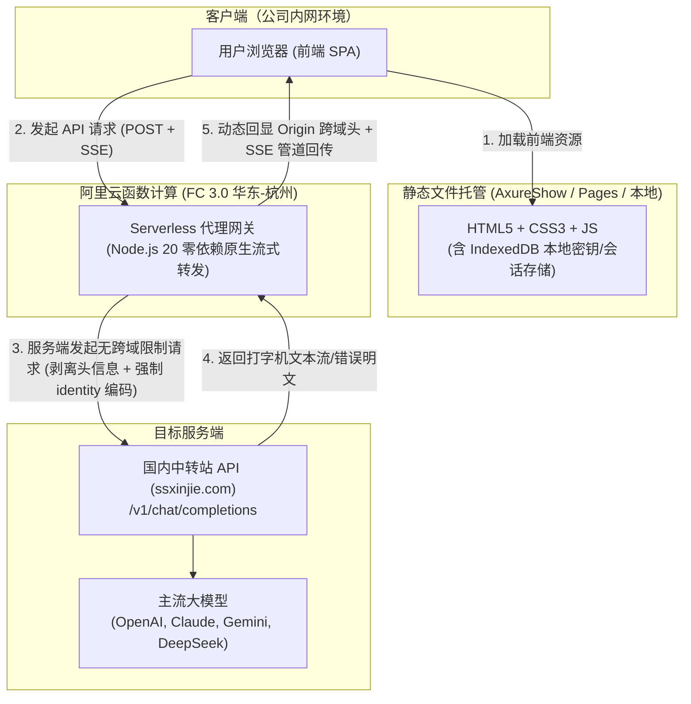

# LLM Chat 项目架构演进与国内云函数代理维护手册

> **文档版本**：v2.0  
> **更新时间**：2026-09-20  
> **适用场景**：国内企业内网稳定访问、解决国内网络对 Cloudflare 阻断/丢包问题、零服务器成本大模型中转

---

## 目录
1. [项目背景与痛点演进](#一项目背景与痛点演进)
2. [总体架构设计](#二总体架构设计)
3. [阿里云函数计算 (FC 3.0) 代理网关实现](#三阿里云函数计算-fc-30-代理网关实现)
4. [核心疑难排坑记录 (Critical Gotchas)](#四核心疑难排坑记录-critical-gotchas)
5. [前端智能调度与容灾设计](#五前端智能调度与容灾设计)
6. [日常维护与排障指南](#六日常维护与排障指南)
7. [成本与用量说明](#七成本与用量说明)

---

## 一、项目背景与痛点演进

### 1.1 原始架构与痛点
* **原始方案**：基于 **Cloudflare Pages + `_worker.js`** 的全栈同源部署架构。
* **业务场景**：用户在**公司内网/局域网**环境下访问网页，上游对接的是**国内大模型中转站 API**（如 `www.ssxinjie.com`）。
* **出现的问题**：
  1. **内网访问频繁丢包/阻断**：国内企业内网网关、DPI 设备或运营商骨干网对 Cloudflare 免费 Anycast IP 段干扰严重，高峰期经常报 `ERR_CONNECTION_TIMED_OUT`。
  2. **企业防火墙与 ECH 冲突**：CF 默认开启的 ECH（加密客户端打招呼）常被企业行为管理网关主动断连重置（报 `ERR_SSL_PROTOCOL_ERROR`）。
  3. **直接调用中转站跨域受阻**：国内中转站前端套了 Cloudflare 盾，对浏览器发起的跨域预检请求（`OPTIONS`）直接拦截并返回 `403 Forbidden`，导致浏览器直接抛出 `TypeError: Failed to fetch`，前端必须依赖代理中转。

### 1.2 架构演进与选型对比

| 方案 | 公司内网访问 | 上游国内中转站 | 域名/备案要求 | 费用成本 | 评估结论 |
| :--- | :--- | :--- | :--- | :--- | :--- |
| **Cloudflare Pages** | ❌ 经常丢包/断连 | ✅ 正常 | ✅ 免备案 | 免费 | 弃用（内网不可控） |
| **海外 VPS / Vercel** | ⚠️ 部分内网偶有拦截 | ⚠️ 绕道海外延迟高 | ✅ 免备案 | 免费 ~ 几十元/月 | 弃用（多余绕路） |
| **国内大陆 VPS 服务器** | ✅ 极速内网直连 | ✅ 极速直连 | ❌ 必须繁琐备案 | 付费购买 | 暂不推荐（备案门槛高） |
| **纯静态托管 + 国内阿里云 FC 代理** | **✅ 极速秒开（10ms）** | **✅ 极速直连** | **✅ 免备案直接使用** | **免费/几毛钱** | **🌟 最终选定最优方案** |

---

## 二、总体架构设计

本项目采用 **前后端物理解耦 + 国内专属边缘代理** 架构：



---

## 三、阿里云函数计算 (FC 3.0) 代理网关实现

### 3.1 基础设施配置清单

| 配置项 | 推荐设定值 | 说明与设计考量 |
| :--- | :--- | :--- |
| **地域** | 华东 1 (杭州) 或 华北 2 (北京) | 靠近国内各大云厂商机房，延迟极低（10~20ms）。 |
| **函数类型** | **Web 函数** | 内置 HTTP 处理能力，直接接管 HTTP/HTTPS 请求。 |
| **运行环境** | **Node.js 20** (或 Node.js 18) | 原生支持全局 `fetch` 与 `ReadableStream`，无需引入三方库。 |
| **最小实例数** | **`0`** | **必须为 0**！实现闲置零实例（Scale-to-Zero），闲置不产生费用。 |
| **单实例并发度** | **`20`** | 纯 I/O 等待型业务，单实例支撑 20 个并发流，大幅消除冷启动并降低时长计费。 |
| **实例规格** | **0.35 vCPU / 0.5 GB 内存** | 最小档规格即可完全满足数百个连接。 |
| **执行超时时间** | **`120` 秒** | 防止模型生成超长思考/文本流时被网关强制切断。 |
| **监听端口** | **`9000`** | 阿里云 Web 函数标准内部端口。 |
| **启动命令** | `node server.js` | 极简启动命令。 |
| **HTTP 触发器认证**| **无需认证 (Anonymous)** | 公开访问，不可设为签名认证。 |

### 3.2 代理服务源码 (`server.js`)

该脚本置于阿里云函数中，具备**零外部依赖、原生流式传输、动态 Origin 识别、强制明文反乱码**等特性：

```javascript
/**
 * 阿里云函数计算 FC 3.0 - 专属国内大模型代理网关
 * 特性：零外部依赖、原生流式传输、动态 Origin 回显、强制明文反乱码
 */
const http = require('http');

const server = http.createServer(async (req, res) => {
  // 1. 动态获取前端请求的真实来源（彻底解决 Credentials: true 与通配符 * 的规范冲突）
  const origin = req.headers['origin'] || '*';
  res.setHeader('Access-Control-Allow-Origin', origin);
  res.setHeader('Access-Control-Allow-Credentials', 'true');
  res.setHeader('Access-Control-Allow-Methods', 'GET, POST, PUT, DELETE, OPTIONS');
  res.setHeader('Access-Control-Allow-Headers', '*');

  // 处理浏览器 OPTIONS 预检请求（直接 200 响应放行）
  if (req.method === 'OPTIONS') {
    res.statusCode = 200;
    res.end();
    return;
  }

  try {
    // 2. 确定目标地址（优先读取请求头 x-target-url，无则默认走配置的中转基址）
    let targetUrlStr = req.headers['x-target-url'];
    if (!targetUrlStr) {
      const defaultBase = 'https://www.ssxinjie.com';
      targetUrlStr = defaultBase.replace(/\/+$/, '') + req.url;
    }

    const targetUrl = new URL(targetUrlStr);

    // 3. 读取前端传入的完整请求体 Body
    const chunks = [];
    for await (const chunk of req) {
      chunks.push(chunk);
    }
    const bodyBuffer = Buffer.concat(chunks);

    // 4. 清洗向上游转发的请求头
    const forwardHeaders = { ...req.headers };
    delete forwardHeaders.host;
    delete forwardHeaders['x-target-url'];
    delete forwardHeaders['content-length'];

    // 🚨【关键修复】：强制要求上游中转站返回原生明文（identity），防止 Gzip/Brotli 二进制乱码
    forwardHeaders['accept-encoding'] = 'identity';

    // 5. 服务端发起真实请求（Node.js 原生 fetch）
    const upstreamRes = await fetch(targetUrl.toString(), {
      method: req.method,
      headers: forwardHeaders,
      body: ['GET', 'HEAD'].includes(req.method) ? undefined : bodyBuffer,
      redirect: 'follow',
    });

    // 6. 转发上游响应头
    res.statusCode = upstreamRes.status;
    for (const [k, v] of upstreamRes.headers.entries()) {
      const key = k.toLowerCase();
      // 过滤可能引起浏览器解析混淆的编码与长度头
      if (['content-length', 'transfer-encoding', 'content-encoding'].includes(key)) {
        continue;
      }
      res.setHeader(k, v);
    }
    res.setHeader('Access-Control-Allow-Origin', origin);
    res.setHeader('Access-Control-Allow-Credentials', 'true');

    // 7. 原生流式管道回传（保证 SSE 打字机流与错误信息即时输出）
    if (upstreamRes.body) {
      const reader = upstreamRes.body.getReader();
      while (true) {
        const { done, value } = await reader.read();
        if (done) break;
        res.write(value);
      }
    }
    res.end();
  } catch (err) {
    res.statusCode = 502;
    res.setHeader('Content-Type', 'application/json; charset=utf-8');
    res.setHeader('Access-Control-Allow-Origin', origin);
    res.setHeader('Access-Control-Allow-Credentials', 'true');
    res.end(JSON.stringify({ error: { message: 'FC代理异常: ' + err.message } }));
  }
});

// 监听 9000 端口（阿里云 Web 函数标准端口）
const port = process.env.FC_SERVER_PORT || 9000;
server.listen(port, () => {
  console.log(`Server listening on port ${port}`);
});
```

---

## 四、核心疑难排坑记录 (Critical Gotchas)

在项目调优过程中，攻克了以下几个非常隐蔽的核心技术问题：

### 1. 为什么浏览器会静默跳过新节点，直接回退到 `api1.yulucha.xyz`？
* **现象**：F12 里看 `PROXY_GATEWAYS` 确实将阿里云排在第一位，但抓包发现请求依然直接打到了 `api1.yulucha.xyz`。
* **排查原因**：
  1. 浏览器 `localStorage` 中之前存留了旧版本配置项 `s.proxyUrl = "https://api1.yulucha.xyz/api/proxy"`。
  2. 调度逻辑中将“用户自定义网关”优先级置于“默认网关”之前，导致旧缓存劫持了默认路由。
* **修复方式**：
  在 [`js/app.js`](file:///c:/Users/a1361/Desktop/llm-chat/js/app.js) 的 `normalizeSettings` 及 `getAvailableProxyGateways` 中加入清理过滤器，自动清除包含 `yulucha.xyz` 或 `workers.dev` 的历史废弃值。

### 2. 阿里云函数 CORS 与 Credentials 规范冲突
* **现象**：浏览器报错 `Access to fetch at '...' has been blocked by CORS policy: The value of the 'Access-Control-Allow-Origin' header must not be the wildcard '*' when credentials mode is allowed.`。
* **排查原因**：
  阿里云 HTTP 触发器底层自动注入了 `Access-Control-Allow-Credentials: true`。根据 W3C CORS 规范，**允许凭证时，`Access-Control-Allow-Origin` 严禁使用通配符 `*`**。
* **修复方式**：
  服务端从请求头读取 `req.headers['origin']` 并动态反射回写，确保返回明确的当前前端域名（如 `https://axureshow.com`）。

### 3. 上游报错显示 Gzip 二进制乱码（出现 `NUL`、`STX`、`RS` 乱码块）
* **现象**：测试不存在的模型时，前端没有拿到预期的英文报错，而是收到一堆形如 `(/...nulXstxnul...` 的乱码字符。
* **排查原因**：
  前端发出的 `Accept-Encoding: gzip, deflate` 被直接透传给上游中转站，上游中转站返回了经过 Gzip 压缩的二进制错误包。由于响应头移除了 `content-encoding`，浏览器未解压直接作为 UTF-8 读取。
* **修复方式**：
  在向上游转发前显式覆盖请求头：`forwardHeaders['accept-encoding'] = 'identity'`，强制上游以原生非压缩明文回传。

---

## 五、前端智能调度与容灾设计

前端在 [`js/app.js`](file:///c:/Users/a1361/Desktop/llm-chat/js/app.js) 中实现了**三层容灾、免费优先与 OPTIONS 快速探活**机制：

```javascript
// 统一内置跨域代理网关：优先走免费 Cloudflare 代理，探测受阻自动无缝降级至国内阿里云专属函数
var PROXY_GATEWAYS = [
  'https://api1.yulucha.xyz/api/proxy',                 // 1. Cloudflare 免费主网关（零费用首选）
  'https://transfer-sybhttgkgu.cn-hangzhou.fcapp.run', // 2. 国内阿里云专属杭州节点（高可用兜底）
  'https://shrill-hat-47ef.a1361470438.workers.dev/api/proxy' // 3. 备用容灾网关
];
```

### 调度流程 (`executeSmartApiRequest` & `tryProxyGateways`)
1. **本地回环直连**：目标为 `localhost` 或 `127.0.0.1` 时，直接走本地网络，不通过任何代理。
2. **目标 API 优先直连探测**：若目标 API 自身支持 CORS 且未被拦截，直连通信，不耗费任何代理资源。
3. **跨域/被墙静默转交代理**：若直连抛出 `TypeError: Failed to fetch` 或触发 403 阻断，自动将请求转交 `availableGateways` 队列。
4. **免费网关 OPTIONS 轻量探活与长文本解耦 (`tryProxyGateways`)**：
   * **物理链路快速探活 (`OPTIONS`)**：在发送庞大的大模型 POST 请求前，先对非末尾网关（包括同源 `/api/proxy` 与独立域名网关）发送轻量级 `OPTIONS` 探活包（3 秒超时）。
     * **网关可达（同源通常数十毫秒，跨域约 200~600ms）**：说明当前网络与代理网关物理连通，立刻放行执行真实 `POST`。
     * **网关被墙/断连（超时 3 秒）**：说明当前公司内网对 CF 严重丢包，控制台打印警告并**立刻转交下一备用网关（国内阿里云函数）**。
   * **双重保障：25 秒首包安全兜底 (`postTimer`)**：
     * 为防止极端情况下 OPTIONS 能通但后续 POST 在内网网关遭遇静默挂起（TCP 丢包无 RST/FIN），为 POST 设置了 25 秒首包超时。
     * **流式兼容**：一旦网关返回 HTTP 响应头，`postTimer` **立即清除**，后续模型思考完成后的流式长文本打字机输出（持续几分钟）完全不受影响。
     * 若超过 25 秒仍未收到任何响应头，则判定当前网关死挂，自动无缝切换至下一个网关。
   * **精准故障判定（5xx & 静态 404）**：
     * 覆盖所有 `500 ~ 599` 服务端故障（特别包含 Cloudflare 常见的 `520 Web Server Returns an Unknown Error`、`522 Connection Timed Out`、`524 A Timeout Occurred`）。
     * 区分静态 404 与业务 404：只有返回静态 HTML 网页的 404（说明托管平台无代理后端）才触发切换；若上游大模型中转站返回 `404 JSON`（如模型不存在/端点未开放），作为正常业务结果直接透传给用户，绝不误切换。
   * **探活结果高频缓存（45 秒有效）**：当前网关连通成功或失败的状态会在本地缓存 45 秒，避免连续多轮对话中频繁重复发送探测请求。

---

## 六、日常维护与排障指南

### 6.1 前端代码更新与缓存刷新
前端修改后，由于浏览器有强缓存机制，推荐按以下步骤操作：
1. 修改 `index.html` 结尾的版本查询参数（如 `?v=20260920_02` $\rightarrow$ `?v=20260920_03`）。
2. 将修改推送到 Git 或重新上传至静态托管服务（如 AxureShow）。
3. 告知内网用户使用 **`Ctrl + F5`**（Mac 电脑 `Cmd + Shift + R`）强制刷新拉取最新逻辑。

### 6.2 阿里云函数维护速查表

| 问题现象 | 可能原因 | 对应解决操作 |
| :--- | :--- | :--- |
| **请求报 400 (Date missing)** | 触发器误开启了签名认证 | 进入触发器配置，将认证方式改回 **无需认证**。 |
| **请求报 502 Bad Gateway** | 上游中转站宕机或 URL 格式错误 | 检查上游基址是否有效，查看函数计算日志（Logstore）。 |
| **回答生成到一半被掐断** | 云函数执行超时配置过短 | 在函数配置中将「执行超时时间」调大（建议 120~300 秒）。 |
| **打字机卡顿、突然整段蹦出** | 响应头被设置了缓冲 | 确保响应头包含 `X-Accel-Buffering: no` 且未开启 Gzip。 |

---

## 七、成本与用量说明

根据阿里云函数计算当前的计费模型：
* **计费项**：`执行时长 (vCPU × 秒 + 内存 × 秒) + 调用次数`。
* **并发复用优势**：因配置了 `单实例并发度 = 20`，在重叠调用时多个请求共用同一个实例的运行时间，实际计费时长被压缩了数倍。
* **实测预估**：
  * **自用 / 部门内部（每日 200 次对话，平均输出 10 秒）**：每月约产生 60,000 秒执行时长与 6000 次调用。
  * **月度总开销**：$\approx 1.5 \sim 2$ 元人民币（若享有每月免费抵扣额度，实际支付常年为 **0 元**）。
